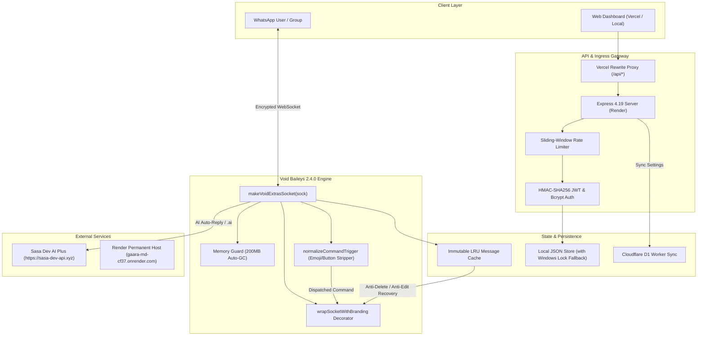

<div align="center">

# ⚡ GAARA X MD 🌸
### Next-Generation Autonomous Multi-Device WhatsApp Bot & Cyber Management Console

[](https://nodejs.org/)
[](https://www.npmjs.com/package/@sasa-dev/void-baileys)
[](#-automated-testing--security-verification)
[](#-security-architecture--hardening)
[](https://gaara-md-cf37.onrender.com)
[](LICENSE)

<br/>

> **GAARA X MD** is an ultra-fast, military-grade autonomous WhatsApp bot and full-stack cybersecurity web console engineered with pure ECMAScript Modules (ESM). Powered by `@sasa-dev/void-baileys@2.4.0`, it features ubiquitous photo-branded replies, native interactive WhatsApp buttons, stealth view-once media extraction, zero-loss anti-delete and anti-edit recovery, permanent server-side Sasa AI Plus integration, and a hardened cyber dashboard.

<br/>

[🌟 Features](#-features-at-a-glance) •
[🚀 Quick Start](#-quick-start) •
[🌐 Web Dashboard](#-web-dashboard--console) •
[🎛️ Interactive Buttons](#️-interactive-whatsapp-buttons--settings) •
[🛡️ Security Hardening](#-security-architecture--hardening) •
[📚 Command Reference](#-complete-command-reference) •
[🧪 Testing](#-automated-testing--security-verification) •
[☁️ Deployment](#-cloud-deployment-guides)

---

</div>

## 📑 Table of Contents
- [🌸 Features at a Glance](#-features-at-a-glance)
- [🏗️ System Architecture](#️-system-architecture)
- [🚀 Quick Start](#-quick-start)
  - [Prerequisites](#prerequisites)
  - [Local Installation](#local-installation)
  - [Pairing via Phone Number](#pairing-via-phone-number)
- [🌐 Web Dashboard & Console](#-web-dashboard--console)
- [🎛️ Interactive WhatsApp Buttons & Settings](#️-interactive-whatsapp-buttons--settings)
- [👁️ View-Once Stealth Mode & Emoji Trigger](#️-view-once-stealth-mode--emoji-trigger)
- [🛡️ Anti-Delete & Anti-Edit Recovery Engine](#️-anti-delete--anti-edit-recovery-engine)
- [🔒 Security Architecture & Hardening](#-security-architecture--hardening)
- [🤖 Sasa Dev AI Plus Engine](#-sasa-dev-ai-plus-engine)
- [📚 Complete Command Reference](#-complete-command-reference)
  - [System & Info (9)](#1-system--telemetry)
  - [Navigation & Menus (2)](#2-navigation)
  - [Media & Stickers (12)](#3-media--stickers)
  - [Downloaders (8)](#4-media-downloaders)
  - [Search & Research (7)](#5-search--research)
  - [Utilities & Tools (17)](#6-utilities--tools)
  - [Group Management (13)](#7-group-management)
  - [Fun & Mini Games (16)](#8-fun--mini-games)
  - [Anime & Wallpapers (6)](#9-anime--art)
  - [AI Assistants (3)](#10-ai-chat)
  - [Profile & Customization (7)](#11-profile--customization)
  - [Owner & Master Controls (14)](#12-owner-controls)
- [🧪 Automated Testing & Security Verification](#-automated-testing--security-verification)
- [☁️ Cloud Deployment Guides](#-cloud-deployment-guides)
  - [Deploying to Render](#deploying-to-render)
  - [Deploying to Vercel (Frontend + Proxy)](#deploying-to-vercel)
  - [Cloudflare D1 Worker Sync](#cloudflare-d1-worker-sync)
- [📄 Project File Structure](#-project-file-structure)
- [💖 Credits & License](#-credits--license)

---

## 🌸 Features at a Glance

| Feature | Description |
|:---|:---|
| **Ubiquitous Photo Branding** | Every single bot reply, notification, and system log automatically embeds high-res thumbnail branding from `assets/bot_icon.jpg` and `THIS BOT BUILT BY GAARA DEV OFC.` via WhatsApp `externalAdReply`. |
| **Interactive WhatsApp Buttons** | Built on `@sasa-dev/void-baileys@2.4.0` extras socket. Full support for classic buttons, template call/URL actions, and native flow interactive cards (`.settings`, `.menu`, pizza demo). |
| **Tapped Button Normalizer** | Automatically cleans decorative emojis and brackets from tapped button texts (`🌸 ALIVE` ➔ `.alive`, `⚡ PING` ➔ `.ping`, `👑 OWNER` ➔ `.owner`), triggering commands instantly without typing. |
| **View-Once Stealth Engine** | 100% silent extraction. When destination is set to `self`, recovered media is routed silently to **Message Yourself** without creating noise or status alerts in the source chat. |
| **View-Once Emoji Trigger** | Unlock view-once media simply by replying with an emoji (e.g. `🔓`, `👁️`, `👀`) or typing `.vv`. Toggle between `Both`, `.vv only`, or `Emoji only`. |
| **Zero-Loss Anti-Delete & Anti-Edit** | Cache immutability guarantees revoke stanzas (`protocolMessage.type === 0`) never overwrite cached message payloads. Deep unwrapping eliminates `(No text content)`. |
| **Void Baileys 2.4.0 Power Architecture** | 24/7 self-healing socket (`alwaysOn`, `alwaysOnline`), low-RAM streaming (`sock.saveMedia()`), Memory Guard (200MB threshold with automated GC), native mini-games (`chess`, `tictactoe`, `connect4`), and poll voting. |
| **Permanent Sasa AI Plus Integration** | Direct server-to-server connection to `https://sasa-dev-api.xyz` using permanent key `Sasa_Dev_Api_3a20968903b0fa8f866eb471f05003a7cd016c44`. Zero client-side key exposure. |
| **Hardened Cyber Web Panel** | Dark red neon dashboard (`/pair`, `/settings`, `/status`) featuring real-time socket telemetry, bcrypt password protection, sliding-window rate limiters, and Cloudflare D1 persistence. |
| **Defensive Security Hardened** | AST recursive-descent math parser (`safeCalc`), ReDoS catastrophic backtracking filter (`isSafeRegex`), prototype pollution shield, timing-safe bcrypt authentication, and strict HTTP security headers (CSP, X-Frame-Options). |

---

## 🏗️ System Architecture



---

## 🚀 Quick Start

### Prerequisites
- **Node.js**: `v20.0.0` or higher (verified and tested on Node `v24.x`)
- **FFmpeg**: Installed and configured on your system `PATH` (required for stickers, audio, and video conversion)
- **Git**: Installed for version control

### Local Installation

1. **Clone the repository**:
   ```bash
   git clone https://github.com/prrxhex-cloud/GAARA-MD.git
   cd GAARA-MD
   ```

2. **Install dependencies**:
   ```bash
   npm install
   ```

3. **Configure Environment Variables**:
   Create a `.env` file from `.env.example`:
   ```bash
   cp .env.example .env
   ```
   Fill in your configuration:
   ```env
   # Server Port & Environment
   PORT=3000
   NODE_ENV=production
   APP_URL=http://localhost:3000
   RENDER_BACKEND_URL=https://gaara-md-cf37.onrender.com

   # Bot Identity
   BOT_NAME="GAARA X MD"
   BOT_PREFIX="."
   OWNER_NUMBER="94771234567"
   OWNER_NAME="GAARA DEV OFC"
   OWNER_BIO="Creator of GAARA X MD Multi-Device WhatsApp Bot"

   # Sasa Dev API Integration (Permanent Server-Side Key)
   SASA_DEV_API_KEY="Sasa_Dev_Api_3a20968903b0fa8f866eb471f05003a7cd016c44"
   SASA_DEV_API_BASE_URL="https://sasa-dev-api.xyz"

   # Security & Panel Authentication
   PANEL_USERNAME="admin"
   PANEL_PASSWORD="your_strong_password"
   PANEL_JWT_SECRET="gaara_x_md_secure_token_secret_key_2026"

   # Anti-Ban & Performance Safeguards
   MEMORY_GUARD_MB=200
   LOW_MEMORY_MODE=true
   ALWAYS_ON=true
   ALWAYS_ONLINE=true
   HUMAN_JITTER_MIN_MS=100
   HUMAN_JITTER_MAX_MS=250
   ```

4. **Start the Bot**:
   ```bash
   npm start
   ```
   *(For development with auto-reload, use `npm run dev`)*

---

### Pairing via Phone Number

1. Open your browser and navigate to `http://localhost:3000/pair` (or your live deployment URL).
2. Enter your WhatsApp phone number with international country code (e.g. `94771234567`).
3. Click **⚡ GET PAIRING CODE**.
4. On your mobile phone, open **WhatsApp > Settings > Linked Devices > Link a Device > Link with phone number instead**.
5. Enter the 8-character pairing code displayed on the screen.
6. Once connected, your bot will automatically deliver a **Gentle Photo Setup Card** with your credentials to your **Message Yourself** chat!

---

## 🌐 Web Dashboard & Console

The web console provides a responsive, dark red cyber interface with live Baileys WebSocket telemetry and full runtime control without restarting the bot:

| Route | Functionality |
|:---|:---|
| **`/pair`** | Interactive pairing portal. Generates 8-character pairing codes with cold-start timeout handling and auto-reset capability. |
| **`/settings`** | Unified control panel featuring 6 categorized modules: <br/>• `01 Automation`: Anti-Call, Anti-Delete, Anti-Edit, View-Once Saver, Auto-Status, Smart AI Auto-Reply.<br/>• `02 Schedules`: Create, manage, and toggle one-time and daily recurring messages.<br/>• `03 Connection`: Real-time WebSocket connection state, uptime, memory telemetry, restart/logout triggers.<br/>• `04 Smart Replies`: Custom trigger keywords, fuzzy matching, and ReDoS-protected regex auto-responses.<br/>• `05 Identity`: Bot name, prefix, custom logo, owner biography for AI context.<br/>• `06 Security`: Bcrypt panel password updates and session invalidation. |
| **`/status`** | Real-time system telemetry: heap memory statistics, OS load, socket ping latency, and message throughput counters. |
| **`/health` & `/ping`** | Keepalive endpoints designed for Render, Cloudflare Workers, and external monitoring probes (UptimeRobot). |

---

## 🎛️ Interactive WhatsApp Buttons & Settings

Powered by `@sasa-dev/void-baileys@2.4.0`, **GAARA X MD** brings interactive UI buttons directly into WhatsApp:

### WhatsApp Button Settings Menu (`.settings` / `.config`)
Configure the bot's runtime behavior entirely from inside WhatsApp without opening the web dashboard:
- **Bot Mode**: `[ 🌐 Public ]`, `[ 🔒 Private ]`, `[ 👥 Groups ]`, `[ 📩 Inbox ]`
- **Anti-Delete Destination**: `[ 🛡️ Delete: Self ]`, `[ 🛡️ Delete: Same ]`
- **Anti-Edit Destination**: `[ ✏️ Edit: Self ]`, `[ ✏️ Edit: Same ]`
- **View-Once Destination**: `[ 🔓 ViewOnce: Self ]`, `[ 🔓 ViewOnce: Same ]`
- **View-Once Trigger Mode**: `[ 🔓 Trigger: Both ]`, `[ 💬 Trigger: .vv ]`, `[ 👁️ Trigger: Emoji ]`

```javascript
// Native Void Baileys interactive buttons integration
const socket = makeVoidExtrasSocket(sock);

await socket.sendButton(jid, {
    text: 'Configure GAARA X MD runtime settings',
    footer: 'THIS BOT BUILT BY GAARA DEV OFC.',
    buttons: [
        { id: 'cfg_mode_public', text: '🌐 Public Mode' },
        { id: 'cfg_mode_private', text: '🔒 Private Mode' },
        { id: 'cfg_delete_self', text: '🛡️ Delete: Self Chat' },
        { id: 'cfg_viewonce_self', text: '🔓 ViewOnce: Self Chat' }
    ]
});
```

### Tapped Button Normalizer
When a user taps an interactive button containing decorative icons (such as `🌸 ALIVE` or `⚡ PING`), WhatsApp forwards the display text. The built-in normalizer automatically strips emojis, brackets, and symbols to resolve the command immediately:
```text
User taps: [ 🌸 ALIVE ]  ➔  Normalized: "alive"  ➔  Executes .alive instantly!
User taps: [ ⚡ PING ]   ➔  Normalized: "ping"   ➔  Executes .ping instantly!
User taps: [ 👑 OWNER ]  ➔  Normalized: "owner"  ➔  Executes .owner instantly!
```

---

## 👁️ View-Once Stealth Mode & Emoji Trigger

Recover disappearing photos, videos, and voice notes with zero exposure:

1. **100% Silent Stealth Sink**:
   When `viewOnceDestination` is set to `self`, executing `.vv` or replying with an emoji generates **zero status messages** in the active chat. Recovered media is routed exclusively and silently to **Message Yourself**.
2. **Emoji Reply Trigger**:
   Simply reply to any View-Once message with an emoji (`🔓`, `👁️`, `👀` or any unicode emoji) to trigger extraction.
3. **Multi-Device & Companion Recovery**:
   Unwraps nested `deviceSentMessage`, `ephemeralMessage`, and `documentWithCaptionMessage` containers, with automated fallback to `getCachedMessage` if WhatsApp strips media bytes from the quoted stanza preview.

---

## 🛡️ Anti-Delete & Anti-Edit Recovery Engine

Never miss revoked or edited messages:

- **Cache Immutability**: Revoke protocol stanzas (`protocolMessage.type === 0`) are strictly prevented from overwriting existing cached messages in memory.
- **Deep Recursive Text Extraction**: [`src/utils/antiBug.js`](file:///D:/Whatsapp%20Bot/src/utils/antiBug.js) extracts text from all message variants, including `editedMessage`, `pollCreationMessage`, `locationMessage`, and `contactMessage`, completely eliminating `(No text content)` notices.
- **Configurable Sinks**: Route recovered messages and media to **Self Chat** (private) or **Same Chat** (public).

---

## 🔒 Security Architecture & Hardening

GAARA X MD is audited and fortified against OWASP Top 10 vulnerabilities:

```
┌────────────────────────────────────────────────────────────────────────┐
│                   DEFENSIVE SECURITY ARCHITECTURE                      │
├─────────────────────────┬──────────────────────────────────────────────┤
│ Threat Vector           │ Mitigation & Defense Mechanism               │
├─────────────────────────┼──────────────────────────────────────────────┤
│ Secrets Disclosure     │ Masked in GET /api/settings (••••••••).      │
│ (CWE-200 / CWE-598)     │ Query string tokens (?token=) rejected.       │
│                         │ Server-side Sasa API & Render URL isolation. │
├─────────────────────────┼──────────────────────────────────────────────┤
│ Brute Force / Credential│ Sliding-window rate limiters on /api/login   │
│ Stuffing (CWE-307)      │ (10 attempts / 15m) & /api/pair (6 / 5m).    │
│                         │ Bcrypt timing-safe password hash (rounds:10).│
├─────────────────────────┼──────────────────────────────────────────────┤
│ Remote Code Execution   │ AST recursive-descent math tokenizer         │
│ (CWE-94 / CWE-95)       │ (safeCalc). Zero eval() or Function().       │
│                         │ Input limit 300 chars, recursion depth <=35. │
├─────────────────────────┼──────────────────────────────────────────────┤
│ ReDoS Backtracking      │ isSafeRegex() blocks catastrophic patterns   │
│ (CWE-1333)              │ (nested quantifiers, overlapping branches).  │
├─────────────────────────┼──────────────────────────────────────────────┤
│ Prototype Pollution     │ sanitizeObject() recursively deletes         │
│ (CWE-1321)              │ __proto__, constructor, and prototype.       │
├─────────────────────────┼──────────────────────────────────────────────┤
│ Directory Traversal     │ sanitizeFilename() strips ../ and sanitizes  │
│ (CWE-22)                │ Windows DOS device names (CON, PRN, AUX...). │
├─────────────────────────┼──────────────────────────────────────────────┤
│ HTTP Attacks & Spoofing │ Helmet security headers: CSP, X-Frame-Options│
│                         │ DENY, X-Content-Type-Options nosniff.        │
├─────────────────────────┼──────────────────────────────────────────────┤
│ WhatsApp Crash Stanzas  │ CRASH_PATTERNS drops zero-width flooding     │
│                         │ (>500 chars), bidi overrides, payloads >15k. │
└─────────────────────────┴──────────────────────────────────────────────┘
```

---

## 🤖 Sasa Dev AI Plus Engine

Direct server-side integration with **Sasa Dev AI Plus**:
- **Permanent API Endpoint**: `https://sasa-dev-api.xyz/api/sasaaiplus/chat`
- **Permanent API Key**: `Sasa_Dev_Api_3a20968903b0fa8f866eb471f05003a7cd016c44`
- **Automated Fallback**: Graceful local assistant fallback if external connectivity is interrupted.
- **Owner Profile Awareness**: Answers reflect the bot owner's name and bio context.
- **Privacy Boundaries**: Group chats (`@g.us`), broadcast channels (`@newsletter`), and blacklisted numbers are strictly excluded from automated AI replies.

---

## 📚 Complete Command Reference

Default prefix: `.` (configurable in web dashboard or via `.setprefix`).

### 1. System & Telemetry
| Command | Aliases | Description |
|:---|:---|:---|
| `.alive` | — | Operational status, RAM consumption, uptime, owner card with thumbnail branding |
| `.ping` | `.speed` | Socket round-trip latency and execution speed |
| `.uptime` | `.runtime` | Exact duration bot has been active |
| `.owner` | `.creator`, `.developer` | Developer contact info & vCard |
| `.system` | `.sys`, `.host` | Detailed host specs (Node.js version, OS, CPU cores, heap memory) |
| `.botinfo` | `.info` | High-level bot architecture summary and active modules |
| `.rules` | — | Bot usage policies and rate-limit guidelines |
| `.speed` | — | Memory stats via `sock.memoryStats()` and uptime in milliseconds |

### 2. Navigation
| Command | Aliases | Description |
|:---|:---|:---|
| `.menu` | `.help`, `.commands` | Categorized interactive command menu with photo card and ASCII frame |
| `.list` | `.allcmd` | Compact alphabetical index of all registered commands |

### 3. Media & Stickers
| Command | Aliases | Description |
|:---|:---|:---|
| `.sticker` | `.s` | Convert quoted/sent image or video (<=10s) into a high-quality WebP sticker |
| `.take` | `.wm` | Modify sticker watermark EXIF metadata (`.take PackName | AuthorName`) |
| `.toimg` | `.photo` | Convert sticker back to a full PNG/JPG image |
| `.tomp3` | `.toaudio` | Convert video or audio note into MP3 format |
| `.readviewonce`| `.vv` | Extract and forward disappearing View-Once photo, video, or voice note |
| `.attp` | — | Generate vibrant rainbow animated text sticker |
| `.round` | `.circle` | Crop an image into a circular WebP sticker |
| `.emojimix` | — | Blend two emojis into a single sticker via Google Emoji Kitchen (`.emojimix 😂+🔥`) |
| `.blur` | — | Apply Gaussian blur filter to an image |
| `.invert` | — | Invert colors of an image |
| `.greyscale` | `.bw` | Convert image to monochrome black-and-white |
| `.getpp` | `.saveprofile` | Fetch HD profile picture and bio of mentioned contact |

### 4. Media Downloaders
| Command | Aliases | Description |
|:---|:---|:---|
| `.play <query>` | — | Search YouTube and stream high-bitrate MP3 audio |
| `.song <query>` | `.ytmp3` | Download audio track directly |
| `.video <query>`| `.ytmp4` | Download HD video track directly |
| `.tiktok <url>` | `.tt` | Download TikTok video without watermark |
| `.ig <url>` | `.insta` | Download Instagram Reels, carousels, or posts |
| `.fb <url>` | `.facebook` | Download Facebook public video streams |
| `.twitter <url>`| `.x` | Download Twitter / X video streams |
| `.gitclone <url>`| — | Download public GitHub repository as a ZIP archive |

### 5. Search & Research
| Command | Aliases | Description |
|:---|:---|:---|
| `.google <query>`| — | Google search summary with source links |
| `.wiki <topic>` | — | Wikipedia summary and topic thumbnail |
| `.lyrics <song>`| — | Search song lyrics |
| `.github <user/repo>` | — | Inspect GitHub user profile or repository statistics |
| `.npm <package>`| — | NPM registry package version, dependencies, and author info |
| `.crypto <coin>`| — | Real-time cryptocurrency market prices (BTC, ETH, SOL, etc.) |
| `.imdb <movie>` | — | Film & TV show ratings, cast, and synopsis |

### 6. Utilities & Tools
| Command | Aliases | Description |
|:---|:---|:---|
| `.calc <expr>` | — | Safe mathematical evaluator (`2^8`, `sqrt(144)`, `sin(45)`) without `eval()` |
| `.qr <text>` | — | Generate QR Code image |
| `.weather <city>`| — | Live meteorological conditions and humidity |
| `.translate <lang> <text>` | `.tr` | Multi-language translation |
| `.tts <lang> <text>` | — | Google Text-to-Speech audio message |
| `.shorturl <url>`| — | URL shortener |
| `.time` | — | Real-time clock across major world timezones |
| `.define <word>`| — | English dictionary definition and phonetics |
| `.morse <text>` | — | Morse code encoder and decoder |
| `.base64 <enc/dec> <text>` | — | Base64 encoder and decoder |
| `.binary <text>`| — | Binary string converter |
| `.currency <amt> <from> <to>` | — | Currency exchange converter |
| `.ip <address>` | — | IP geolocation and ISP lookup |
| `.fliptext <text>`| — | Upside-down and reversed text generator |
| `.fancy <text>` | — | Stylish unicode font generator |
| `.genpass <len>`| — | Cryptographically random password generator |
| `.quoted` | — | Inspect quoted message metadata, sender JID, and timestamps |
| `.jid` | — | Inspect current chat JID or quoted user JID |

### 7. Group Management
| Command | Aliases | Description |
|:---|:---|:---|
| `.kick @user` | — | Remove member from group (admin required) |
| `.add <number>` | — | Add participant to group |
| `.promote @user`| — | Grant group admin privileges |
| `.demote @user` | — | Revoke group admin privileges |
| `.tagall <text>`| — | Mention all group members with formatted list |
| `.hidetag <text>`| — | Mention all group members invisibly |
| `.tagadmin <text>`| — | Alert all group admins with priority notice |
| `.link` | — | Retrieve group invite link |
| `.revoke` | — | Reset group invite link |
| `.mute` / `.unmute` | — | Lock group for admins only or open for all |
| `.setname <name>`| — | Update group subject |
| `.setdesc <desc>`| — | Update group description |
| `.groupinfo` | — | Comprehensive group metadata and member breakdown |
| `.leave` | — | Bot exits the group |

### 8. Fun & Mini Games
| Command | Aliases | Description |
|:---|:---|:---|
| `.tictactoe` | `.ttt` | Play interactive Tic-Tac-Toe vs Bot or friend |
| `.chess` | — | Play Chess vs engine via UCI moves (`e2e4`) |
| `.roll` | — | Roll virtual dice (1–6 or custom range) |
| `.coin` | — | Flip coin (Heads or Tails) |
| `.joke` | — | Programming or general humor joke |
| `.fact` | — | Science or history trivia fact |
| `.truth` | — | Party truth prompt |
| `.dare` | — | Party dare challenge |
| `.8ball <question>` | — | Magic 8-Ball fortune reading |
| `.ship @u1 @u2`| — | Love compatibility percentage calculator |
| `.riddle` | — | Brain riddle with revealable answer |
| `.quote` | — | Inspirational quote |
| `.roast` | — | Friendly comedy roast |
| `.compliment` | — | Uplifting compliment |
| `.rate <item>` | — | Random rating percentage |

### 9. Anime & Art
| Command | Aliases | Description |
|:---|:---|:---|
| `.waifu` | — | Random anime waifu art |
| `.neko` | — | Cute anime neko art |
| `.shinobu` | — | Shinobu Kocho art |
| `.megumin` | — | Megumin explosion art |
| `.animequote` | — | Famous anime quote |
| `.wallpaper` | — | HD anime wallpaper |

### 10. AI Chat
| Command | Aliases | Description |
|:---|:---|:---|
| `.ai <prompt>` | `.ask`, `.chat` | Direct query to Sasa AI Plus with owner context |
| `.ask <prompt>` | — | Fast Q&A assistant |
| `.chat <prompt>`| — | Conversational dialogue |

### 11. Profile & Customization
| Command | Aliases | Description |
|:---|:---|:---|
| `.getbio @user` | — | Read WhatsApp about/bio text |
| `.setpp` | — | Update bot profile picture from quoted image |
| `.setbio <text>`| — | Update bot profile status bio |
| `.setbotname <name>` | — | Change bot display name |
| `.setbotlogo <url>` | — | Update bot logo image URL |
| `.addreply <trigger \| reply>` | — | Add custom keyword auto-reply |
| `.delreply <trigger>` | — | Remove custom auto-reply |
| `.listreply` | — | List all configured custom auto-replies |
| `.clearreplies` | — | Wipe all custom auto-replies |

### 12. Owner Controls
| Command | Aliases | Description |
|:---|:---|:---|
| `.settings` | `.config` | Interactive WhatsApp buttons control console |
| `.mode <public/private/groups/inbox>` | — | Switch bot access mode |
| `.anticall <on/off>` | — | Toggle Anti-Call automatic rejection |
| `.antidelete <on/off>` | — | Toggle Anti-Delete recovery guard |
| `.autostatus <on/off>` | — | Toggle Auto-Status view & like |
| `.block @user` | — | Block contact |
| `.unblock @user` | — | Unblock contact |
| `.broadcast <text>` | — | Transmit broadcast message to active chats |
| `.setprefix <char>` | — | Change bot command prefix symbol |
| `.eval <code>` | — | Execute JavaScript in isolated context (owner only) |
| `.exec <cmd>` | — | Execute system command on host (owner only) |
| `.clearcache` | — | Flush message and rate-limiting memory caches |
| `.restart` | — | Perform clean socket reconnection |
| `.join <link>` | — | Join WhatsApp group via invite link |

---

## 🧪 Automated Testing & Security Verification

Run the full automated test suite using Node's native test runner:

```bash
npm test
```
*(Runs `node --test tests/*.test.js`)*

```text
▶ Node.js Automated Test Suite Output
✔ 1. Configuration & Security Tests (10 tests)
✔ 2. Anti-Bug & Sanitization Tests (8 tests)
✔ 3. LRU Cache & Rate Limiting Tests (6 tests)
✔ 4. Message Formatting & Framing Tests (5 tests)
✔ 5. Anti-Call Warning Engine Tests (7 tests)
✔ 6. Anti-Delete & Anti-Edit Handlers Tests (9 tests)
✔ 7. Full Bot Commands Suite (120 tests)
✔ 8. Interactive WhatsApp Buttons Settings & Advanced Recovery Tests (15 tests)
✔ 9. Void Baileys Native Power, SASA DEV API & Trigger Normalization Tests (12 tests)
✔ Media & Utilities Deep Tests (3 tests)
▶ GAARA X MD - Multi-Layer Security & Vulnerability Test Suite
  ✔ 1. JWT Authentication & Cryptographic Integrity (8 tests)
  ✔ 2. HTTP Security Headers & Information Leakage Defense (2 tests)
  ✔ 3. Rate Limiting & Route Authentication Barriers (7 tests)
  ✔ 4. Secrets Hygiene & Masking Defense (2 tests)
  ✔ 5. Safe Math Evaluator (safeCalc) & Injection Protection (6 tests)
  ✔ 6. ReDoS Detection & Auto-Reply Hardening (4 tests)
  ✔ 7. Prototype Pollution & Input Sanitization Defense (3 tests)
  ✔ 8. Bot Privilege Enforcement & Anti-Bug Defense (4 tests)
✔ Multi-Layer Security & Vulnerability Test Suite (37 tests)

---------------------------------------------------------------------------------
ℹ tests 230
ℹ suites 19
ℹ pass 230
ℹ fail 0
ℹ duration_ms 6582.4212
```

---

## ☁️ Cloud Deployment Guides

### Deploying to Render
1. Push your repository to GitHub.
2. Log into [Render Dashboard](https://dashboard.render.com/) and create a **New Web Service**.
3. Connect your repository.
4. Set the following build and start commands:
   - **Environment**: `Node`
   - **Build Command**: `npm install`
   - **Start Command**: `npm start`
5. Under **Environment Variables**, add:
   ```env
   NODE_ENV=production
   PORT=3000
   APP_URL=https://your-service.onrender.com
   RENDER_BACKEND_URL=https://gaara-md-cf37.onrender.com
   SASA_DEV_API_KEY=Sasa_Dev_Api_3a20968903b0fa8f866eb471f05003a7cd016c44
   PANEL_USERNAME=admin
   PANEL_PASSWORD=your_secure_password
   PANEL_JWT_SECRET=your_jwt_secret
   ```
6. Deploy service. Use the `/health` and `/ping` endpoints to configure keepalive pings.

---

### Deploying to Vercel
The repository includes a ready-to-deploy [`vercel.json`](file:///D:/Whatsapp%20Bot/vercel.json) that serves the public frontend and automatically proxies `/api/*` requests to your permanent Render backend:

```json
{
  "$schema": "https://openapi.vercel.sh/vercel.json",
  "outputDirectory": "public",
  "cleanUrls": true,
  "rewrites": [
    { "source": "/api/:path*", "destination": "https://gaara-md-cf37.onrender.com/api/:path*" },
    { "source": "/", "destination": "/settings.html" },
    { "source": "/settings", "destination": "/settings.html" },
    { "source": "/pair", "destination": "/pair.html" },
    { "source": "/status", "destination": "/status.html" }
  ]
}
```

1. Import the repository into [Vercel](https://vercel.com/).
2. Select default settings and click **Deploy**.
3. All requests from the Vercel dashboard seamlessly connect to the backend without CORS issues or manual origin configuration!

---

### Cloudflare D1 Worker Sync
A dedicated Cloudflare Worker is included in `worker/` connected to database `ofc-database` (`863d050f-0ee6-488c-adb9-28a082e99f2c`). Settings, schedules, and custom auto-replies are synced to the edge via `src/services/cfSync.js`, ensuring settings persist even when sessions are unlinked.

---

## 📄 Project File Structure

```text
GAARA-MD/
├── assets/
│   └── bot_icon.jpg              # Permanent high-res bot thumbnail asset
├── config/
│   ├── constants.js              # Application headers, defaults, and CRASH_PATTERNS
│   ├── database.js               # Multi-table JSON store with Windows NTFS lock fallback
│   └── index.js                  # Central configuration loader (.env & defaults)
├── data/                         # Local persistence store (settings, users, replies)
├── public/                       # Cyber-themed dashboard frontend
│   ├── css/style.css             # Cyber red/neon stylesheet
│   ├── js/app.js                 # Settings dashboard logic
│   ├── js/pair.js                # Pairing portal controller
│   ├── pair.html                 # Pairing interface
│   ├── settings.html             # Multi-tab configuration panel
│   └── status.html               # Live socket telemetry monitor
├── src/
│   ├── bot/
│   │   ├── buttons.js            # Void Baileys interactive buttons & settings handlers
│   │   ├── cache.js              # Immutable LRU message cache & rate limiters
│   │   ├── extras.js             # Void Baileys 2.4.0 power wrappers (games, polls)
│   │   ├── format.js             # wrapSocketWithBranding, ASCII framing & setup cards
│   │   ├── handler.js            # Ingress router, normalizer, and event multiplexer
│   │   ├── loggerNotifier.js     # System event logger with ad-reply context
│   │   └── socket.js             # Baileys socket lifecycle & 60s memory guard
│   ├── commands/                 # 12 modular command suites (120+ commands)
│   │   ├── ai.js                 # Sasa AI Plus chat commands (.ai, .ask, .chat)
│   │   ├── media.js              # View-Once (.vv), stickers, and format converters
│   │   ├── owner.js              # Owner administration, mode, and cache flush
│   │   ├── utilities.js          # AST safeCalc math, QR, translations, currency
│   │   └── ...                   # Group, Games, Downloader, Anime, Search, System
│   ├── handlers/
│   │   ├── antiCall.js           # 3-warning call rejection and auto-block
│   │   ├── antiDelete.js         # Revoke stanza recovery engine
│   │   ├── antiEdit.js           # Message edit diff and comparison engine
│   │   ├── autoReply.js          # Trigger matcher & Sasa AI 1-on-1 auto-replies
│   │   ├── autoStatus.js         # Auto-status viewer and emoji reactor
│   │   └── scheduler.js          # Scheduled task execution engine
│   ├── server/
│   │   ├── app.js                # Express app, security headers & static routes
│   │   ├── auth.js               # Timing-safe bcrypt authentication & JWT tokens
│   │   ├── rateLimiter.js        # Sliding-window IP rate limiting
│   │   └── routes.js             # REST API endpoints (/api/pair, /api/settings...)
│   ├── services/
│   │   ├── cfSync.js             # Cloudflare D1 Worker synchronization client
│   │   └── sasaApi.js            # Sasa Dev API client with server-side credentials
│   ├── utils/
│   │   ├── antiBug.js            # Malformed stanza drop & recursive text extraction
│   │   ├── logger.js             # Pino structured logging
│   │   ├── media.js              # FFmpeg conversions & sticker EXIF injection
│   │   └── security.js           # AST safeCalc, isSafeRegex, sanitizeObject
│   └── index.js                  # Application entry point
├── tests/
│   ├── bot.test.js               # Bot lifecycle, buttons, and command tests
│   ├── media.test.js             # FFmpeg conversion and sticker metadata tests
│   └── security.test.js          # 37 multi-layer security & penetration tests
├── worker/                       # Cloudflare D1 Worker schema & endpoints
├── vercel.json                   # Vercel deployment & API proxy configuration
├── package.json                  # Dependencies & npm scripts
└── README.md                     # Comprehensive technical documentation
```

---

## 💖 Credits & License

- **Lead Architect & Developer**: **GAARA DEV OFC**
- **Core WhatsApp Engine**: [`@sasa-dev/void-baileys`](https://github.com/darksasa1-eng/void-baileys)
- **AI Engine**: [SASA DEV AI PLUS](https://sasa-dev-api.xyz)

Distributed under the **MIT License**. See `LICENSE` for more information.

<div align="center">

```text
╭───[ 🌸 GAARA X MD SUPPORT ]
│◇│
│◇│  THIS BOT BUILT BY GAARA DEV OFC.
│◇│  POWERED BY @SASA-DEV/VOID-BAILEYS V2.4.0
│◇│
╰──────────────────────────────────────────
```

**⭐️ Star this repository if GAARA X MD powers your WhatsApp experience!**

</div>
